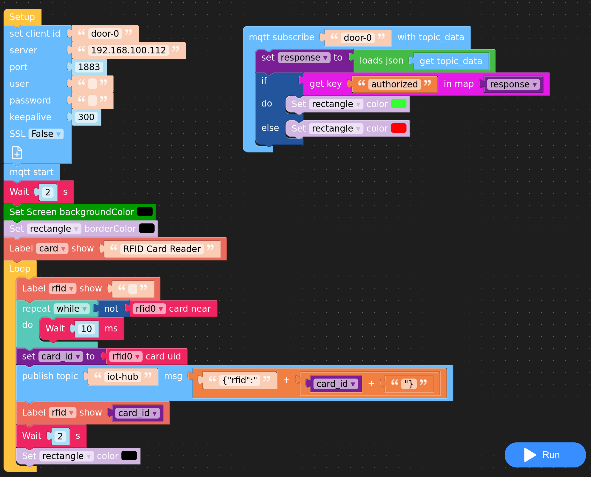

# Mule MQTT demonstration project

This project demonstrate how to to MQTT communication between an IoT device and a Mule Application.

## Demonstration video

## M5SitckCPlus code

[Download](src/main/resources/MQTT_RFID.m5f)

